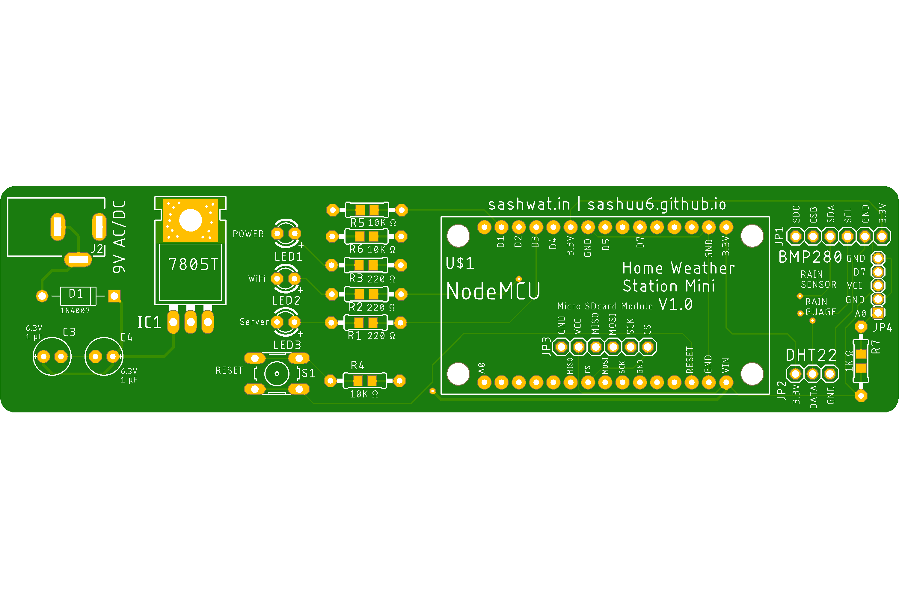
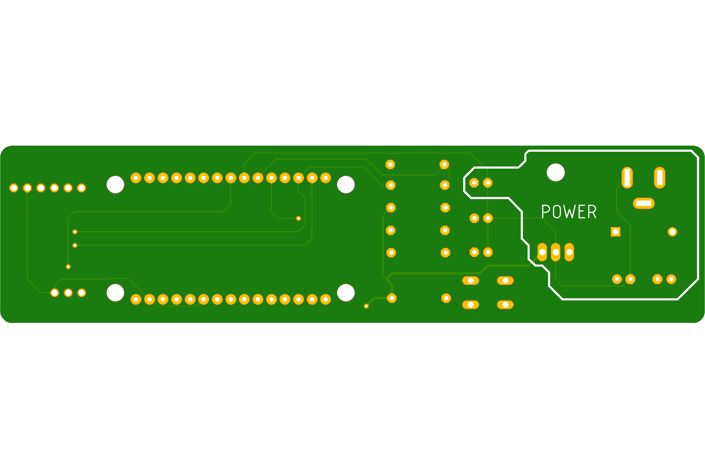
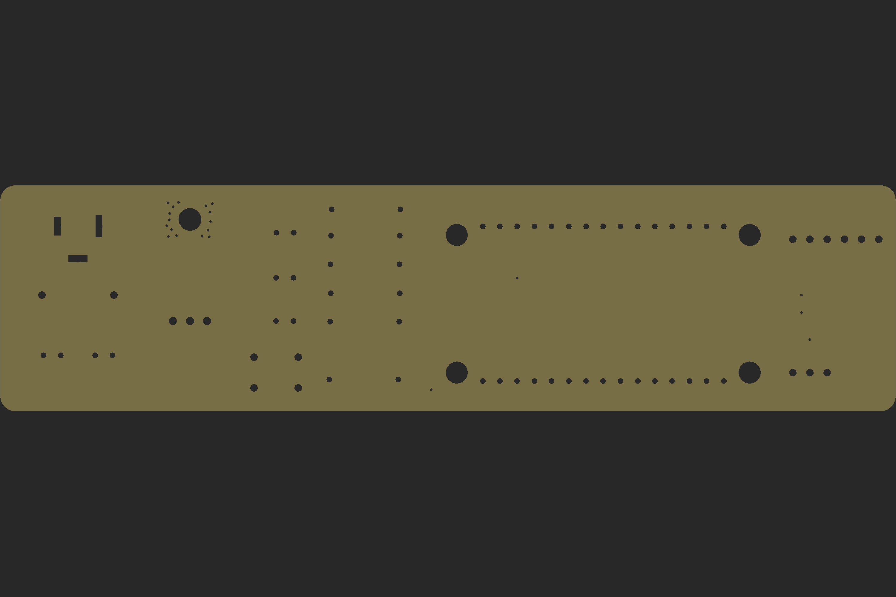

# Home Weather Station Mini

## Introduction

The Home Weather Station Mini is a DIY weather station that collects the following data and uploads the data to database:-

1. Temperature
2. Humidity
3. Altitude
4. Rain (CM)
5. Rain duration and strength

## Features

1. Collects data and stores the data in database.
2. A web application to show current weather data.

## Folder Structure

1. docs: PCB images (Top, Bottom and Drill).
2. eagle-design: Eagle design of PCB.
3. libraries: Contains the libraries to be added to Arduino IDE.
4. nodemcu-code: Contains nodemcu code for collecting weather data, web application to show weather data and upload data to firebase.

## Components Used

1. NodeMCU - [Tomson Electronics](https://www.tomsonelectronics.com/products/buy-nodemcu-esp8266-esp-12e-with-ch340-online?_pos=4&_sid=e5db98597&_ss=r)
2. DHT22 - [Tomson Electronics](https://www.tomsonelectronics.com/products/dht22-digital-temperature-and-humidity-sensor-module-am2302)
3. BMP 280 - [Tomson Electronics](https://www.tomsonelectronics.com/products/bmp-280-barometer-precision-atmospheric-pressure-sensor-module)
4. DC Barrel Power Jack - [Tomson Electronics](https://www.tomsonelectronics.com/products/dc-barrel-power-jack)
5. Switch - [Tomson Electronics](https://www.tomsonelectronics.com/products/6mmx6mmx6mm-micro-switch)
6. Diode IN 4007 - [Tomson Electronics](https://www.tomsonelectronics.com/products/diode-1n-4007)
7. Capacitor (1uF 63V) - [Tomson Electronics](https://www.tomsonelectronics.com/products/100uf-16v-radial-electrolytic-capacitor)
8. 7805 5V regulator - [Amazon (India)](https://www.amazon.in/5-piece-voltage-regulator-7805/dp/0070530572)
9. LED - [Tomson Electronics](https://www.tomsonelectronics.com/products/led-basic-green-5-mm)
10. Micro SD Card Module - [Tomson Electronics](https://www.tomsonelectronics.com/products/micro-sd-card-module)
11. Rain drop detection sensor Module - [Tomson Electronics](https://www.tomsonelectronics.com/products/rain-drop-detection-sensor-rain-detector-weather-module)
12. Reed switch - [Tomson Electronics](https://www.tomsonelectronics.com/products/reed-switch-16mm)
13. Resistpr (1K, 10K Ohms) - [Tomson Electronics](https://www.tomsonelectronics.com/products/1ko-12ko-carbon-film-resistor)
14. Resistor (220 Ohms) - [Tomson Electronics](https://www.tomsonelectronics.com/products/100k-ohm-metal-film-resistor?variant=8737726038107) 
15. Pole, Wires, tapes and zip ties

Discount code for Tomson Electronics : ZENOOFF2020

## PCB design

### Top View

### Bottom View

### Drill View

## Pre-Installation Steps

1. Connect the sensors as per circuit diagram.
2. Add the necessary credentials in nodemcu code.
3. Flash the code in NodeMCU

## Sensor Info

| Sensor name | Features |
|-------------|----------|
| DHT22 | Temperature, Humidity and Heat Index |
| BMP280 | Temperature, atmospheric pressure and altitude |
| Rain Guage | Rain in CM |
| Rain drop sensor | Rain Duration and Strength |

## Contributions

1. Sashwat K (@sashuu6) <sashwat0001@gmail.com>
