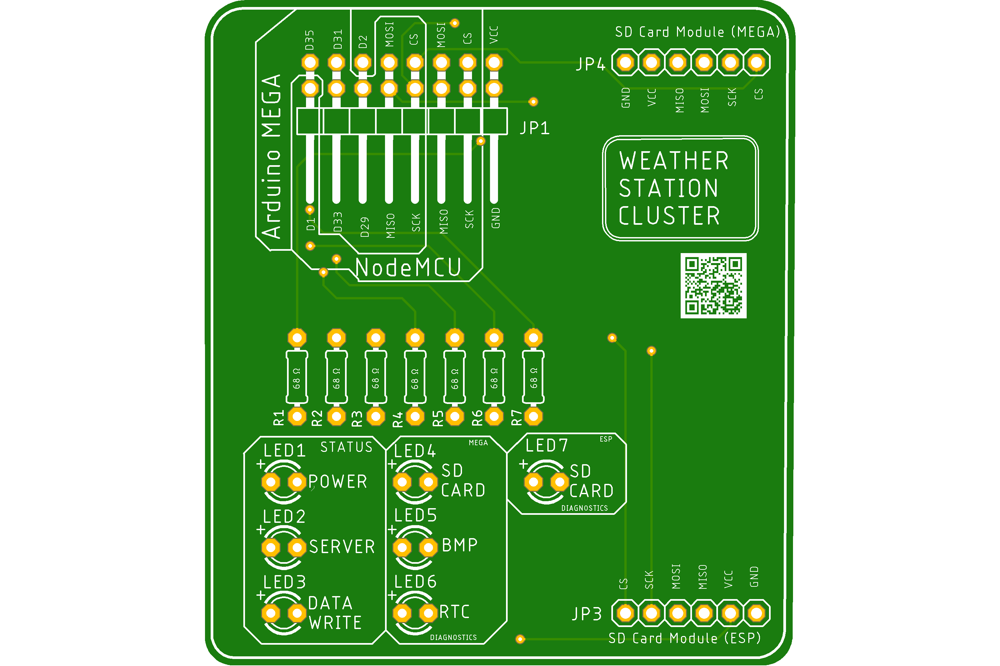
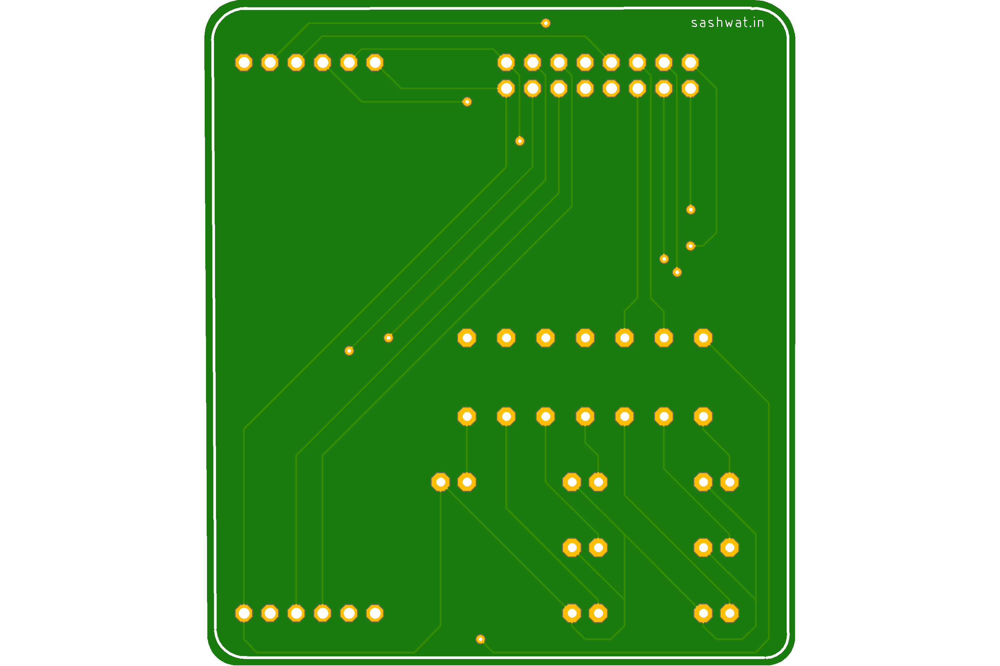
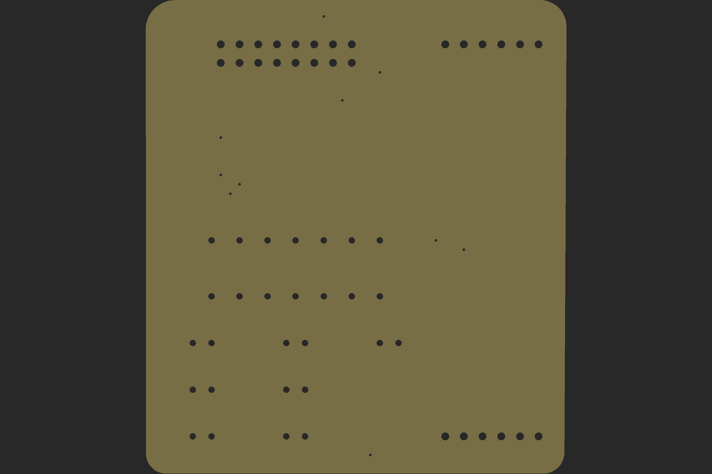
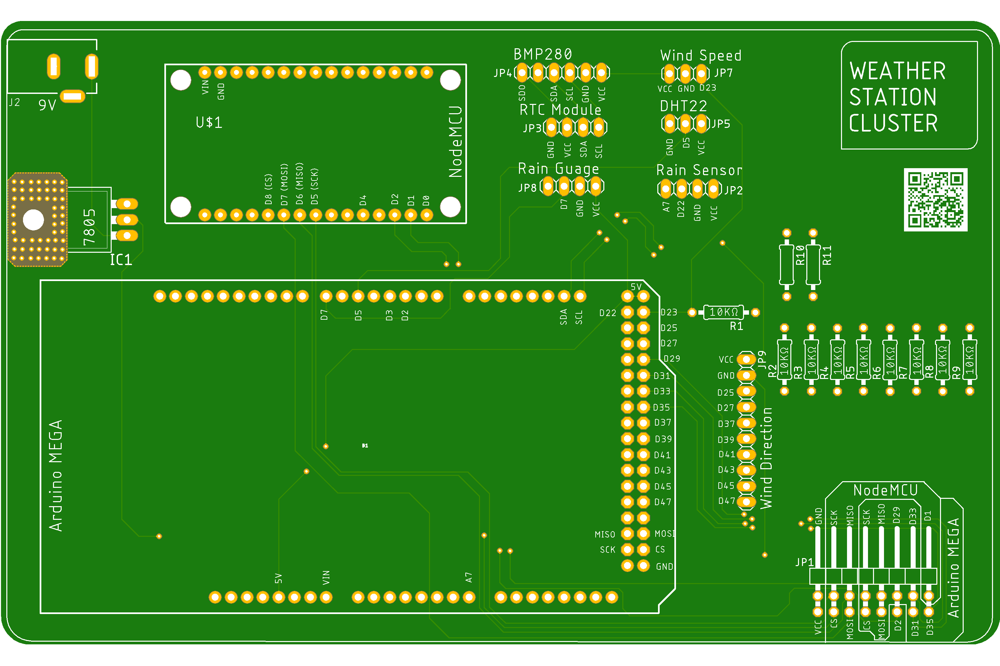
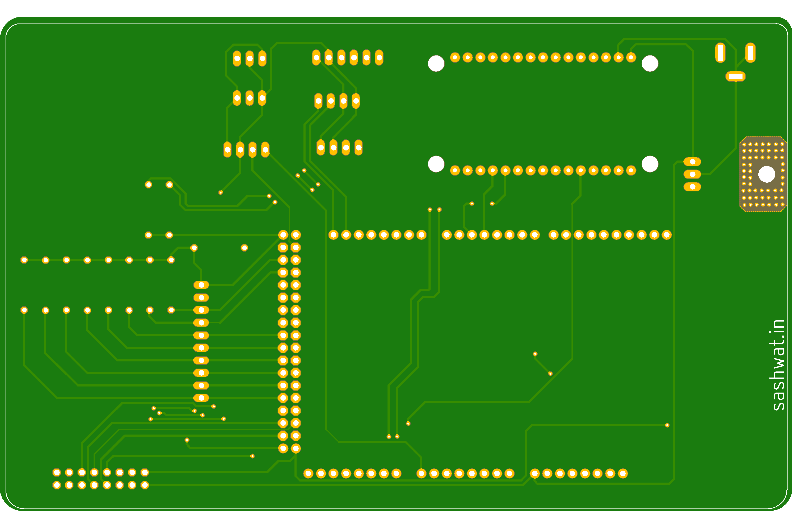
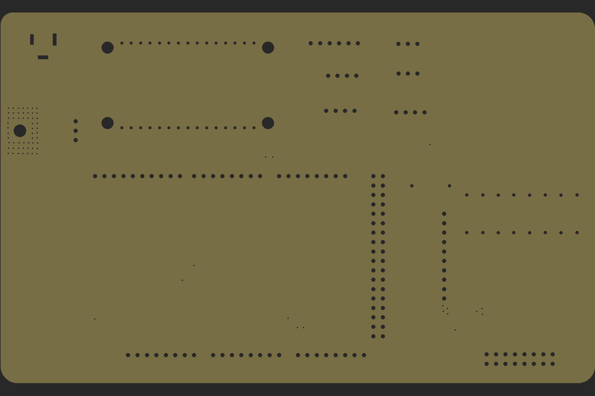

# Weather Station Cluster

## The project is still under progress

## Introduction

The Weather Station Cluster is weather station system for ethusiasts that want to measure data for education and research purposes.

## Features

1. The device collects the following data:-
    1. Temperature
    2. Humidity
    3. Heat index
    4. Altitude
    5. Pressure
    6. Rain (in cm)
    7. Rain duration and strength
    8. Wind speed
    9. Wind direction
2. Collects the above mentioned parameters and stores the data to database.

## Folder Structure

1. code/arduino_mega-code: Contains code for Arduino Mega.
2. code/nodemcu-code: Contains code NodeMCU.
3. docs: PCB images (Top, Bottom and Drill).
4. eagle-design: Eagle design of PCB.
5. fusion360-design: STL files of rain guage, wind direction and wind speed.

## Library used

1. DHT22 Library - [GitHub](https://github.com/adafruit/DHT-sensor-library)
2. BMP280 Library - [GitHub](https://github.com/mahfuz195/BMP280-arduino-library)
3. RTC Library - [GitHub](https://github.com/adafruit/RTClib)

## CAD Files

1. Rain sensor support - [Thingiverse](https://www.thingiverse.com/thing:4107951)

## Components Used

1. NodeMCU (x1) - [Tomson Electronics](https://www.tomsonelectronics.com/products/buy-node-mcu-esp-8266-with-cp-2102-online)
2. Micro SD card module (x1) - [Tomson Electronics](https://www.tomsonelectronics.com/products/micro-sd-card-module)
3. Arduino Mega (x1) - [Tomson Electronics](https://www.tomsonelectronics.com/products/buy-arduino-mega-2560-online-india)
4. DHT22 (x1) - [Tomson Electronics](https://www.tomsonelectronics.com/products/dht22-digital-temperature-and-humidity-sensor-module-am2302)
5. BMP 280 (x1) - [Tomson Electronics](https://www.tomsonelectronics.com/products/bmp-280-barometer-precision-atmospheric-pressure-sensor-module)
6. Rain sensor (x1) - [Tomson Electronics](https://www.tomsonelectronics.com/products/rain-drop-detection-sensor-rain-detector-weather-module)
7. Speed Measuring sensor Groove Coupler Module (x1) - [Tomson Electronics](https://www.tomsonelectronics.com/products/speed-measuring-sensor-groove-coupler-module-for-arduino)
8. RTC module (x1) - [Tomson Electronics](https://www.tomsonelectronics.com/products/ds1307-i2c-rtc-ds1307-24c32-real-time-clock-module)
9. Button cell (CR-2032) (x1) - [Tomson Electronics](https://www.tomsonelectronics.com/products/panasonic-cr-2032)
10. Female headers - [Robu (India)](https://robu.in/product/2mm-pitch-female-berg-strip-40x1-2pcs/)
11. Male header pins - [Robu (India)](https://robu.in/product/1x40-berg-strip-male-connector/)
12. DC Barrel Power Jack (x1) - [Tomson Electronics](https://www.tomsonelectronics.com/products/dc-barrel-power-jack)
13. LED (Red) (x4) - [Tomson Electronics](https://www.tomsonelectronics.com/products/led-basic-red-5mm-pack-of-10)
14. Diode IN 4007 (x1) - [Tomson Electronics](https://www.tomsonelectronics.com/products/diode-1n-4007)
15. 7805 5V regulator (x1) - [Amazon (India)](https://www.amazon.in/5-piece-voltage-regulator-7805/dp/0070530572)
16. LED (Green) (x3) - [Tomson Electronics](https://www.tomsonelectronics.com/products/led-basic-green-5-mm)
17. Micro SD Card Module (x1) - [Tomson Electronics](https://www.tomsonelectronics.com/products/micro-sd-card-module)
18. Rain drop detection sensor Module (x1) - [Tomson Electronics](https://www.tomsonelectronics.com/products/rain-drop-detection-sensor-rain-detector-weather-module)
19. Resistor (10K Ohms) (x2) - [Tomson Electronics](https://www.tomsonelectronics.com/products/1ko-12ko-carbon-film-resistor)
20. Resistor (220 Ohms) (x7) - [Tomson Electronics](https://www.tomsonelectronics.com/products/100k-ohm-metal-film-resistor?variant=8737726038107)
21. Neodymium disc magnets (4x1.5mm) (x2) - [Tomson Electronics](https://www.tomsonelectronics.com/products/neodymium-disc-magnets?variant=37753432768707)
22. Neodymium disc magnets (4x1.5mm) (x1) - [Tomson Electronics](https://www.tomsonelectronics.com/products/neodymium-disc-magnets?variant=37753432801475)
23. PLA (1KG) (WHITE) (x1) - [Tomson Electronics](https://www.augment3di.com/product/white-pla-premium-filament-1kg/)
24. Pole, Wires, tapes and zip ties

## PCB design

### Info Board

#### Top View

#### Bottom View

#### Drill View

### Process Board

#### Top View

#### Bottom View

#### Drill View

## Pre-Installation Steps

1. Connect the sensors as per circuit diagram.
2. Flash the NodeMCU code.
3. Connect to NodeMCU WiFi hotspot (SSID: Home Weather Station Mini) WiFi hotspot.
4. Goto http://192.168.4.1 (NodeMCU gateway).
5. Enter WiFi credentials.
6. After connecting to WiFi, use Fing to get IP address of NodeMCU.
7. Goto http://ip-address and enter username (admin) and password (pasword).
8. Enter server IP address, API key and other necessary details.

## Sensor Info

| Sensor name | Features |
|-------------|----------|
| DHT22 | Temperature, Humidity and Heat Index |
| BMP280 | Temperature, atmospheric pressure and altitude |
| Rain Guage | Rain in CM |
| Rain drop sensor | Rain Duration and Strength |
| Annemometer | Wind speed and wind direction |

## Contributions

1. Sashwat K (@sashuu6) <hi@sashwat.in>
2. Tharun P Karun (@tharunpkarun) <tpk@tharun.me>
3. Sreeram (STL files) [YouTube](https://www.youtube.com/channel/UC3x_svxO5Dxl0VesjEMpuGg)
